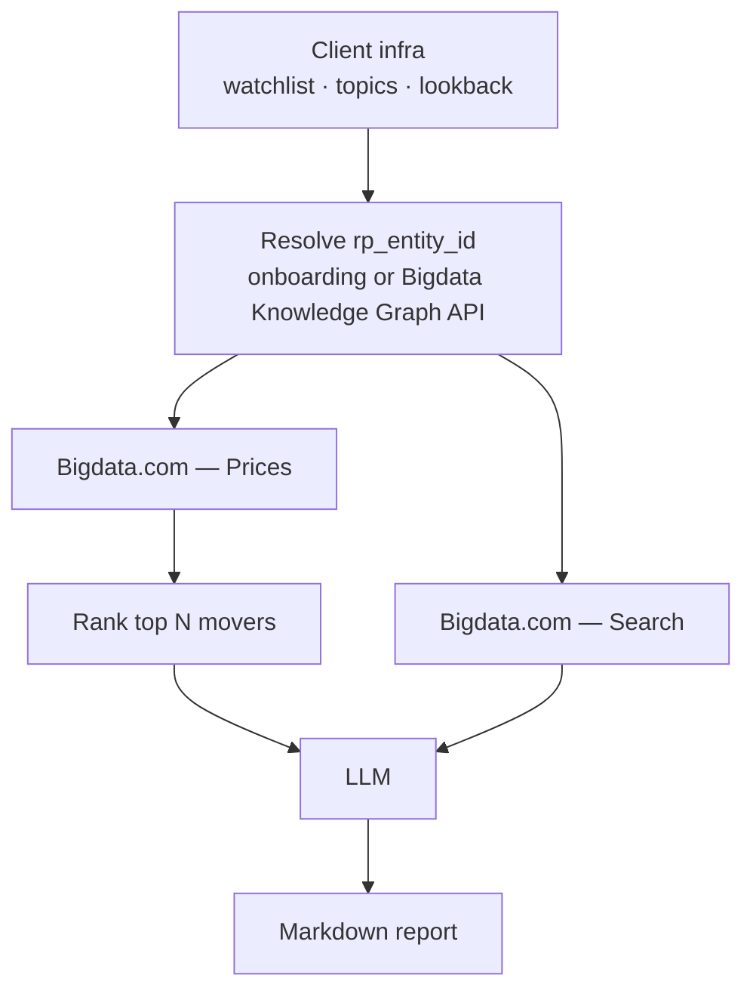

# Portfolio Top Movers

Demo-friendly **Top Movers** report generator: sample tickers from **SGX**, **Toronto (TSX)**, and **Nasdaq**, with AI-powered daily gainers and decliners analysis.

## Overview

This application generates reports showing **Top 5 Gainers** and **Top 5 Decliners** from a configurable multi-exchange watchlist (default: TSX, SGX, and Nasdaq names), with AI-powered news analysis and commentary for each mover.

**Cadence:** The defaults are a good fit for a **daily or weekly** run. If you need a **longer lookback**, a **higher run frequency**, or other behavior beyond that, you will likely need **additional steps in the pipeline**—in that case, reach out to your **sales executive**.

## Workflow

High-level flow (same pipeline as the [playground notebook](notebooks/top_movers_playground.ipynb)):



1. **Client infra** supplies tickers, topics, and lookback (web UI, API, or notebook).
2. **`rp_entity_id`** is resolved once — typically during **onboarding**, or at runtime via the **Bigdata Knowledge Graph API**.
3. **Bigdata.com** provides **prices** (to rank movers) and **search** (news/topic context for those movers).
4. An **LLM** turns that context into short commentary; the pipeline emits a **markdown report**.

### Features

- **Daily Movers Analysis**: Identifies top gainers and decliners from a configurable watchlist
- **News Search**: Searches for relevant news and events from the past 24 hours
- **AI-Powered Commentary**: Generates 3-7 sentence summaries explaining each move
- **Custom Topics**: Users can define and configure their own topics to tailor news search and analysis to their specific use case
- **Real-time Status**: UI shows processing progress and status updates
- **Report History**: SQLite storage for all generated reports
- **User API Keys**: Users can configure their Bigdata API key in the Settings UI; it is sent as **`X-API-KEY`** for Bigdata calls and to access job/report HTTP APIs when the server has no default key

## Quick Start

### Prerequisites

- Python 3.10+
- [uv](https://docs.astral.sh/uv/)
- Bigdata API key in **`.env`** and/or via the Settings UI (see **Security notes**)
- OpenAI API Key or Google Gemini API Key (for LLM commentary)

### Installation with uv

```bash
cd portfolio-top-movers

# Install dependencies from the lock file (creates .venv if needed)
uv sync --extra dev

# Copy environment file and configure
cp .env.example .env
# Edit .env with your API keys (see Environment Variables)
```

### Running Locally

```bash
uv run python main.py
```

The server listens on `PORT` if set, otherwise **8000** (for example `http://localhost:8000`).

## Usage

1. Open the web interface (for example `http://localhost:8000` if `PORT` is unset).
2. **Settings** (modal opens automatically if the server has no `BIGDATA_API_KEY` and you have not saved a key in the browser)
   - **Bigdata API key**: stored in the browser and sent as **`X-API-KEY`** on API requests. It is **required** in the UI when the server does not set `BIGDATA_API_KEY`; otherwise it is optional and overrides the server default.
   - Click **Save Changes**.
3. Enter market tickers (default: 30 symbols across TSX, SGX, and Nasdaq)
   - Accepts formats: `XSES:D05` or just `D05`
4. Select number of top movers (default: 5)
5. Click "Generate Report"
6. Monitor progress in real-time
7. Download the completed report

## Security notes

- **`X-API-KEY` (Bigdata)**: Job/report routes and report creation use the same resolution as Bigdata: the client may send **`X-API-KEY`**, or the server may supply **`BIGDATA_API_KEY`**. If the server env is unset, the client **must** send **`X-API-KEY`** or those routes return **401**. **`GET /api/watchlist`**, **`GET /api/topics`**, and **`GET /api/config`** stay unauthenticated so the UI can load.
- **Browser storage**: Keys in `localStorage` are visible to the same origin; treat the UI as a convenience for demos, not a high-assurance secret store.

## Default Watchlist

The default watchlist contains **30** symbols across **TSX**, **SGX**, and **Nasdaq** (see `config/watchlist.py`):

```
XTSE:RY, XTSE:SHOP, XTSE:TD, XTSE:ENB, XTSE:BN, XTSE:CP, XTSE:BMO, XTSE:CNR, XTSE:CNQ, XTSE:BNS,
XSES:D05, XSES:O39, XSES:Z74, XSES:U11, XSES:S63, XSES:J36, XSES:F34, XSES:S68, XSES:H78, XSES:BN4,
XNAS:NVDA, XNAS:AAPL, XNAS:MSFT, XNAS:AMZN, XNAS:GOOGL, XNAS:AVGO, XNAS:META, XNAS:TSLA, XNAS:ASML, XNAS:MU
```

## Nasdaq Tickers (for testing)

```
AAPL,ABNB,ADBE,ADI,ADP,ADSK,AEP,ALNY,AMAT,AMD,AMGN,AMZN,ANSS,APP,ARM,
ASML,AVGO,AXON,AZN,BKR,BKNG,CDNS,CEG,CHTR,CMCSA,COST,CPRT,CRWD,CSCO,
CSGP,CSX,CTAS,CTSH,DASH,DDOG,DXCM,EA,EXC,FANG,FAST,FER,FTNT,GEHC,GILD,
GOOGL,HON,IDXX,INTC,INTU,ISRG,KDP,KHC,KLAC,LRCX,LIN,MAR,MCHP,MDLZ,MELI,
META,MNST,MPWR,MSFT,MSTR,MU,NFLX,NVDA,NXPI,ODFL,ORLY,PANW,PAYX,PCAR,
PDD,PEP,PLTR,PYPL,QCOM,REGN,ROP,ROST,SBUX,SHOP,SNPS,STX,TEAM,TMUS,
TSLA,TTWO,TXN,VRSK,VRTX,VSNT,WBD,WDAY,WDC,XEL,ZS
```

## API Endpoints

Job and report routes require a **resolved Bigdata key**: **`X-API-KEY`** header and/or server **`BIGDATA_API_KEY`** (same rules as `POST /api/report`). If neither is available, they return **401**.

| Endpoint | Method | Bigdata gate | Description |
|----------|--------|--------------|-------------|
| `/` | GET | No | Web interface |
| `/api/config` | GET | No | `{ "server_has_bigdata_key": bool }` for the UI |
| `/api/watchlist` | GET | No | Default watchlist |
| `/api/topics` | GET | No | Topic templates |
| `/api/report` | POST | Yes | Create report job |
| `/api/reports` | GET | Yes | List jobs |
| `/api/status/{job_id}` | GET | Yes | Job status |
| `/api/report/{job_id}/download` | GET | Yes | Download Markdown report |
| `/api/report/{job_id}/view` | GET | Yes | Report body (plain text) |
| `/api/report/{job_id}/search-results` | GET | Yes | Search CSV |
| `/api/report/{job_id}/movers-data` | GET | Yes | Movers JSON |
| `/api/report/{job_id}` | DELETE | Yes | Delete job |
| `/api/logs/{job_id}` | GET | Yes | Job logs |

## Environment Variables

| Variable | Required | Description |
|----------|----------|-------------|
| `BIGDATA_API_KEY` | No* | Server-side Bigdata default; if unset, clients must send `X-API-KEY` on gated routes |
| `LLM_PROVIDER` | No | LLM provider: 'auto', 'openai', or 'gemini' (default: auto) |
| `OPENAI_API_KEY` | Conditional | Required if using OpenAI |
| `GEMINI_API_KEY` | Conditional | Required if using Gemini |
| `DB_STRING` | No | SQLite connection string (default: sqlite:///jobs.db) |
| `PORT` | No | Server port (default: 8000) |
| `LOG_LEVEL` | No | Logging level (default: INFO) |

\* Users can store a Bigdata key in the Settings UI (`X-API-KEY`). If `BIGDATA_API_KEY` is set on the server, the browser key is optional and overrides when provided.

## Development

```bash
uv sync --extra dev
uv run pytest
uv run uvicorn main:app --reload --host 127.0.0.1 --port 8000
```

## License

This project is licensed under the MIT License; see the [LICENSE](LICENSE) file.

## Demo notice and production use

This repository is intended to **demonstrate Bigdata capabilities** (company resolution, pricing, and news search) together with optional LLM commentary. The web UI can store the Bigdata **`X-API-KEY`** in **browser `localStorage`** and send it on API requests so visitors can try the flow when no server-side **`BIGDATA_API_KEY`** is configured, or override the server default from the browser. That pattern is a **convenience for demos and prototypes**, not a recommendation for high-assurance production systems: any script running on the same origin could read stored keys, and passing keys from the browser increases exposure compared to keeping credentials only on the server.

**If you deploy this or anything derived from it for production**, you are responsible for your own **security, compliance, and operational due diligence**—including how you authenticate users, store and rotate API keys, scope network access, monitor usage and cost, and meet your organization’s and vendors’ terms. Treat the defaults and UI behaviors here as a starting point, not a finished production design.
